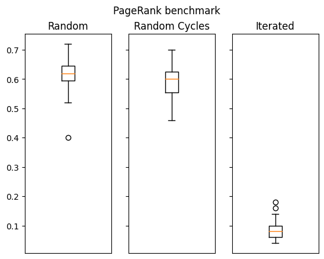
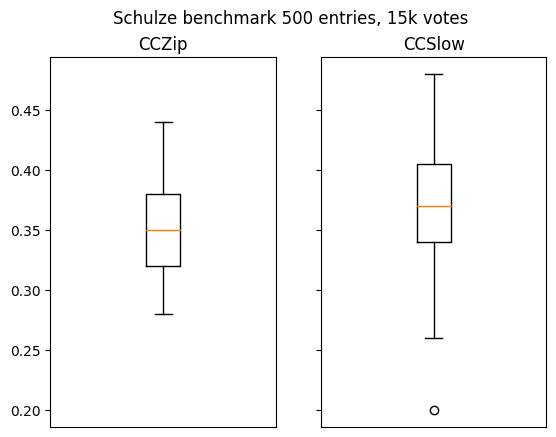
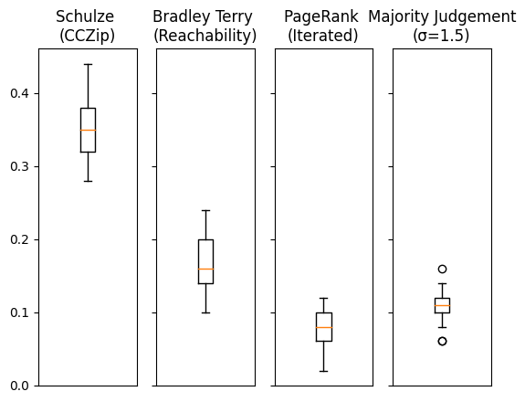

# Voting Systems Benchmark

The problem: choosing a voting system for an event like a massive competition.

Most voting systems were not designed to deal with sparse data. This repo implements and benchmarks different voting systems for massive competitions and tries to answer the natural question: is there a better approach?

## Implemented voting systems

- Bradley-Terry models: different variants are considered depending on the ways to pair entries.
  - Random pairing
  - Grouping entries in random cycles and pairing the adjacent ones, in order to create an underlying undirected expander (Random cycles)
  - Cycling through the strongly connected components, to increase the directed graph connectivity (CCZip)
  - Computing the reachability (minimum path) between each entries and pairing the ones further appart (Reachability)
  - Crowd BT
- PageRank
  - Random pairings
  - Random cycles pairings
  - Iterative PageRank: after each N votes (cycles of pairings) compute the current PageRank and the ordered list is used for the next iteration, comparing adjacent entries from the list
- Schulze
- Majority Judgement

## Benchmark
### Methodology

The benchmark is done as follow:

1. Generate a random ranking on N entries, which would be the 'true' ranking.
2. Generate votes according to the true ranking with a certain amount of noise. Eg. if A if ranked better than B in the true ranking, then the vote is A>B with 90% chance if we have 10% noise.
3. Measure how good the resulting ranking is by comparing the true ranking from the computed ranking. The measure used is a comparison of the top 10% measuring how many entries of the computed top 10% were not in the real top 10%. This top10% measure is a pseudo distance and the smaller the number the better.

The best voting systems should correctly infer the true ranking from the aggregation of individual rankings.

### Parameters

The parameters used come from the real world scenario example motivating this research: the Summer of Math Exposition competition (SoME3).

- 500 entries
- 15 000 votes

We also added 10% noise for the benchmark to take into account errors.

## Results

### Bradley Terry variants

As expected the choice of pairing impacts the vote, and it turns out that optimizing for strong connectivity is a good idea:

### PageRank variants

It turns out the PageRank algorithm is very sensitive to noise, but iterating helps improve the results

### Schulze

The Schulze voting system is one of the better voting systems in classical situations, but unfortunately it doesn't perform so well with sparse data.

### Majority Judgement

This one is different as people grade each individual entries.

15000 votes on pairs do not correspond to 30000 individual votes because of entries appearing multiple times. So to be conservative a budget of 20000 votes was allocated for this benchmark, which corresponds to 40 votes per entry.

Also from our surveys with 500 people grading the event or the website, for a 1-10 continuous grading scale we observed a typical spread of 1.5

## Conclusion

Comparing together the best pairings for each family of algorithms gives the following table:

So it would seem that the more accurate voting systems are the Iterated PageRank and the Majority Judgement. However PageRank is really sensitive to noise where the Majority Judgement is much more robust.

So the Majority Judgement is a good algorithm in a massive competition setting as it is both precise and robust and allows us to expect about 85-90% of accuracy on the top 10%

## References

Majority Judgment
- Michel Balinski and Rida Laraki (2007). *A theory of measuring, electing, and ranking* Proceedings of the National Academy of Sciences. https://www.pnas.org/doi/abs/10.1073/pnas.0702634104

Bradley Terry based models:
- David R. Hunter (2004). *"MM algorithms for generalized Bradley-Terry models."* Ann. Statist. 32 (1) 384 - 406. https://doi.org/10.1214/aos/1079120141
- Chen, Xi and Bennett, Paul N. and Collins-Thompson, Kevyn and Horvitz, Eric (2013). *"Pairwise Ranking Aggregation in a Crowdsourced Setting."* WSDM '13: Proceedings of the sixth ACM international conference on Web search and data mining. Pages 193–202.  https://doi.org/10.1145/2433396.2433420

Expander graphs:
- Joel Friedman (2004). *"A proof of Alon's second eigenvalue conjecture and related problems"* Memoirs of the American Mathematical Society. https://arxiv.org/abs/cs/0405020

## License

[CC-BY-4.0](LICENSE)

 This work is licensed under a <a rel="license" href="http://creativecommons.org/licenses/by/4.0/">Creative Commons Attribution 4.0 International License</a>.
